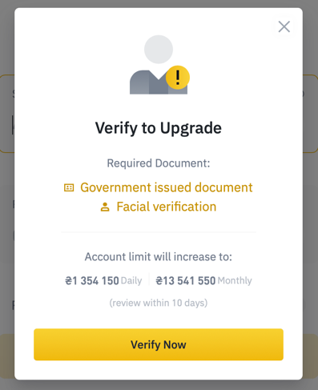
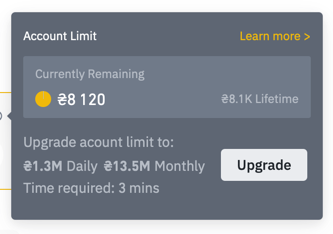
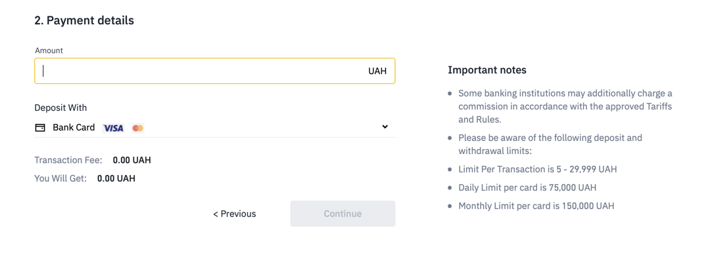
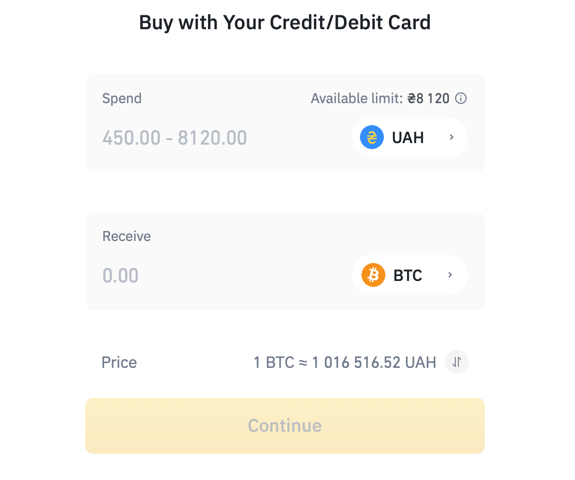
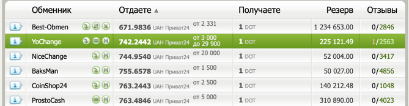
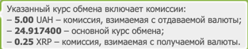

# How to buy/sell crypto

Getting crypto for fiat is quite simple. There are three main ways how you can do that:

### Buy crypto from an official dealer (Binance, Kuna, other exchanges)

These require you to reveal your identity, that is you have to register an
account on one of the exchanges. 

This is the most convenient, yet the most
privacy-compromising one. 

The daily amount is very limited, at least on Binance,
which means you would have to repeat the process several times to deposit a
relatively large sum (and
probably pay some considerable fees). 

In Ukraine, the daily limit is set at around
$300 USD (or higher with other transfer methods) with
an "unverified" account. 

To make the limit higher, you would go through a standard
identification process, which means you would have to make a photo of your
identification document and your face. This is a normal thing to do if you
are ok with revealing your personal information to an exchange, but the moment the
exchange gets compromised, attackers are able to take legal action using
your identity.

### Buy crypto through unofficial cryptocurrency exchange

This way of buying crypto is much riskier than the previous one. In short,
you would find a service which provides fiat-to-crypto exchange (typically through
an aggregator). 

The column names mean: exchange, price for 1 coin/token, reserved funds (how many
units of this currency does the exchange have) and negative/positive reviews

  [Bestchange.ru](http://bestchange.ru)

 

Then, depending on the service, you would make a transfer to the
service's bank account (manual exchange) and get sent crypto to your account manually.

In addition, there are two more types of such exchanges: semi-auto and automatic.
Semi-automatic exchanges rely on an external payment provider (e.g., way4pay) so that
you don't have to do manual transfers. Automatic ones typically use automated software
that validates banking transaction and immediately sends funds to your crypto account.

Some exchanges impose their own fees:

translated:
- 5 uah when transferring to the exchange's fiat account
- 24.917 - main exchange rate (XRP currency)
- 0.25 XRP fee

There is a potential risk of entirely losing your funds, but typically that doesn't
happen. It is profitable for the exchanges to have good reputation, especially on
big aggregators.

The advantages are that you don't have to reveal your identity beyond
credit card level, while being able to buy more than some exchanges limit daily.
Furthermore, the exchanges typically do not charge any fees.
Still, there are some disadvantages. to name a couple: less profitable exchange rate,
potential scam, slower processing.

Some exchange rates are outrageous:

(at the time of writing, global average BTC/USD rate is 36768 USD for 1 BTC,
these exchanges offer more than 50000 USD for 1 BTC)

Still, there are plenty with good rates.

### Buy crypto with cash

This is a pretty scary way to get cryptocurrency, but probably the most efficient one.
There are offline exchanges operating in different cities. They could also be found
through an aggregator. Typically, you would meet up with a person in a secure place,
where they would get cash, and instantly, under your supervision and validation, send
crypto to your account. This is a nice way to buy large amounts of crypto ($5k+), but
the risks are present here, too. No law protects you from giving your money to a stranger
at will, and no transaction is recorded, which means taking legal action becomes impossible.
Moreover, this method should be executed with great care, as there is always a risk
of getting robbed.

Advantages: unlimited transaction size, validation from you, speed
Disadvantages: dangerous, potential scam

TWO LATTER METHODS CAN ALSO BE USED TO SELL CRYPTOCURRENCIES.

**TAKE IT WITH GREAT CARE!!!**

  * [Binance](http://binance.com)
  * [Binance's guide](https://www.binance.com/en/blog/318034612921425920/How-to-Buy-Bitcoin-A-Quick-Guide-from-Binance)
  * [Kuna](http://kuna.io)
